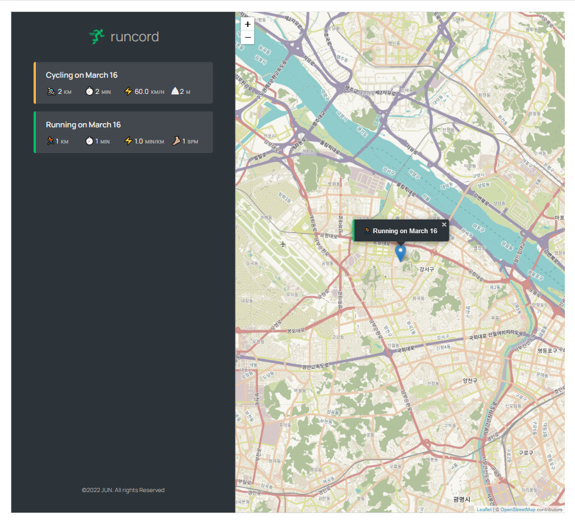

## Runcord

 

 
 

    
        
        
    

 

## 🏠 [Runcord](https://runcord.netlify.app/)

 

⏱ 런닝 / 사이클을 지도와 기록을 기록하고 지도에 지도를 마킹 하는 웹 앱 입니다.

 

 

## 📌 주요 기능

| [🔗 런닝 / 사이클 추가](https://github.com/jackma914/js-run_record_app/wiki/%F0%9F%93%8C-%EB%9F%B0%EB%8B%9D---%EC%82%AC%EC%9D%B4%ED%81%B4-%EC%B6%94%EA%B0%80) | [🔗 로그인](https://github.com/jackma914/react-mern-todo_list/wiki/%F0%9F%93%8C-%EB%A1%9C%EA%B7%B8%EC%9D%B8,-%EC%9C%A0%ED%9A%A8%EC%84%B1---%EA%B8%B0%EB%8A%A5-%EC%86%8C%EA%B0%9C) | [🔗 todo 추가](https://github.com/jackma914/react-mern-todo_list/wiki/%F0%9F%93%8C-todo-%EC%B6%94%EA%B0%80,%EC%88%98%EC%A0%95,%EC%82%AD%EC%A0%9C,%EC%99%84%EB%A3%8C----%EA%B8%B0%EB%8A%A5-%EC%86%8C%EA%B0%9C) | [🔗 todo 수정](https://github.com/jackma914/react-mern-todo_list/wiki/%F0%9F%93%8C-todo-%EC%B6%94%EA%B0%80,%EC%88%98%EC%A0%95,%EC%82%AD%EC%A0%9C,%EC%99%84%EB%A3%8C----%EA%B8%B0%EB%8A%A5-%EC%86%8C%EA%B0%9C) |
| :-----------------------------------------------------------------------------------------------------------------------------------------------------------: | :-------------------------------------------------------------------------------------------------------------------------------------------------------------------------------: | :-----------------------------------------------------------------------------------------------------------------------------------------------------------------------------------------------------------: | :-----------------------------------------------------------------------------------------------------------------------------------------------------------------------------------------------------------: |
|                                                                                                            |                                                                                                                                  |                                                                                                                                                                |                                                                                                                                                                |

| [🔗 todo 삭제](https://github.com/jackma914/react-mern-todo_list/wiki/%F0%9F%93%8C-todo-%EC%B6%94%EA%B0%80,%EC%88%98%EC%A0%95,%EC%82%AD%EC%A0%9C,%EC%99%84%EB%A3%8C----%EA%B8%B0%EB%8A%A5-%EC%86%8C%EA%B0%9C) | [🔗 todo 완료](https://github.com/jackma914/react-mern-todo_list/wiki/%F0%9F%93%8C-todo-%EC%B6%94%EA%B0%80,%EC%88%98%EC%A0%95,%EC%82%AD%EC%A0%9C,%EC%99%84%EB%A3%8C----%EA%B8%B0%EB%8A%A5-%EC%86%8C%EA%B0%9C) | [🔗 로그아웃](https://github.com/jackma914/react-mern-todo_list/wiki/%F0%9F%93%8C-%EB%A1%9C%EA%B7%B8%EC%95%84%EC%9B%83---%EA%B8%B0%EB%8A%A5-%EC%86%8C%EA%B0%9C) | [🔗 유효성 검사](https://github.com/jackma914/react-mern-todo_list/wiki/%F0%9F%93%8C-%ED%9A%8C%EC%9B%90%EA%B0%80%EC%9E%85,-%EC%9C%A0%ED%9A%A8%EC%84%B1---%EA%B8%B0%EB%8A%A5-%EC%86%8C%EA%B0%9C) |
| :-----------------------------------------------------------------------------------------------------------------------------------------------------------------------------------------------------------: | :-----------------------------------------------------------------------------------------------------------------------------------------------------------------------------------------------------------: | :-------------------------------------------------------------------------------------------------------------------------------------------------------------: | :---------------------------------------------------------------------------------------------------------------------------------------------------------------------------------------------: |
|                                                                                                                                                                |                                                                                                                                                                |                                                                                                              |                                                                                                                                                |

 

## 📌 플로우 차트

