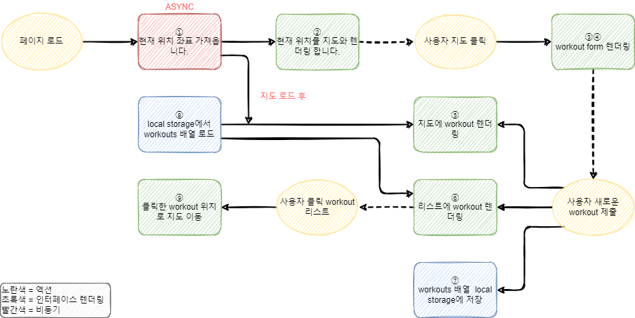
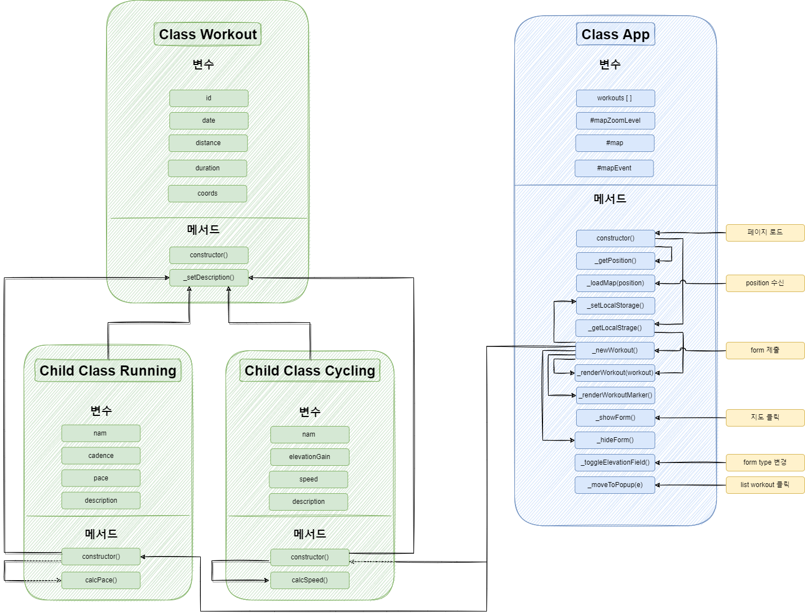

# 🏃‍♂️ [Runcord](https://runcord.netlify.app/)

 

    
        
        
    

 
 

## 📝 서비스 소개

 
 

 

⏱ 런닝 / 사이클을 지도와 기록을 기록하고 지도에 지도를 마킹 하는 웹 앱 입니다.  

https://runcord.netlify.app/

 

## 
📌 주요 기능

 

| [🔗 form 추가 ](https://github.com/jackma914/js-run_record_app/wiki/%F0%9F%93%8C-%EB%A7%B5-%ED%81%B4%EB%A6%AD) | [🔗 런닝/사이클 추가](https://github.com/jackma914/js-run_record_app/wiki/%F0%9F%93%8C-%EB%9F%B0%EB%8B%9D-%EC%82%AC%EC%9D%B4%ED%81%B4-%EC%B6%94%EA%B0%80) | [🔗 맵 이동](https://github.com/jackma914/js-run_record_app/wiki/%F0%9F%93%8C-%EB%A7%B5-%EC%9D%B4%EB%8F%99) |
| :------------------------------------------------------------------------------------------------------------: | :-------------------------------------------------------------------------------------------------------------------------------------------------------: | :---------------------------------------------------------------------------------------------------------: |
|                                                                    |                                                                                                                     |                                                                     |

 
 

## 🛠 flowchart (흐름도)

 

### ✔ Runcord의 흐름도 입니다.

 
 

1. Geolocation API를 사용하여 사용자의 현재 위치 좌표를 받아옵니다.
2. 위치를 받아오면 현재 위치를 지도 중앙으로 이동합니다.
   - 사용자가 새로운 workout 추가를 하기위해 지도를 클릭합니다.
3. 거리, 시간,속도, 걸음 수/분 을 입력하는 input form을 렌더링합니다.
4. 거리, 시간,속도, 고도 획득(elevation gain) 을 입력하는 input form을 렌더링합니다.
5. 새로운 workout form이 제출되면 지도에 workout 정보와 렌더링 되어 지도에 마커를 표시합니다.
6. 새로운 workout form이 제출되면 지도에 workout 정보와 렌더링 되어 리스트에 추가됩니다.
7. 로컬 저장소에 workouts 배열 데이터가 저장됩니다.
8. 페이지 로드시 로컬 저장소에 workouts 배열을 로드합니다.
9. 로드된 리스트를 클릭시 해당 리스트의 정보와 일치하는 지도의 마커의 위치로 이동합니다.

 

### ✔ Class App와 Class Workout의 아키텍처 흐름도입니다.

---

 
 

## 🌟 트러블 슈팅

1. bind()

   - `_getPosition()` 메서드에서 `_loadMap()` 메서드로 위치 정보를 첫번째 인자로 보냅니다. 그냥 메서드를 호출해서 인자로 데이터를 보내면 오류가 발생합니다.
     이유는 여기서 `_loadMap()` 메서드는 getCurrentPosition의 콜백 함수인 일반함수로 호출 됩니다. 즉 `_loadMap()`의 this 키워드는 정의되지 않았습니다.
     해결 방법은 수동으로 메서드에 this를 바인딩 합니다. 이번 오류로 인해 binding을 이해했습니다.
     `this._loadMap.bind(this)`

      

2. 글로벌 함수,변수

   - 코드를 클래스화 시키면서 map 함수와 mapEvent 변수를 받아오면 에러가 발생합니다. 이를 해결하기위해 class App에 글로벌 함수와 변수로 선언해주었습니다.
     이번 오류로 인해 클래스를 장점인 가독성과 재사용성과 글로벌 변수에 대해 이해했습니다..
     `#map, #mapEvent`

      

3. 호이스팅

   - 함수는 정의하기전에 호출할 수 있지만 클래스는 반드시 정의한 뒤에 사용 가능합니다. 이유는 클래스가 호이스팅 될때 초기화는 되지 않기 때문입니다.

      

4. 에로우 함수

   - `validInput` 함수를 구현중 에로우 함수를 사용하였습니다. 중괄호를 생략하거나 return을 해야했는데 중괄호를 사용하고 유일한 문장이라 생각해 return을 해주지 않았습니다. 이로인해 계속해서 input form을 제출시 계속해서 정상 작동하지 않았습니다. 에러도 발생하지 않고 오작동만해서 이유를 찾는데 오랜 시간이 걸렸습니다. 중괄호를 지우고서 해결 되었습니다.

      

5. 재할당

   - if문 속에있는 변수를 사용해야 하는 상황에서 계속 에러가 발생했습니다.
     이유는 블록스코프 이기때문에 if문 밖에서 사용할수 없었습니다. 이를 해결 하기 위해 if문 밖에 let으로 선언한뒤 if문 솎의 변수를 재할당함으로써 블록 밖에서도 변수를 사용할수 있었습니다.

      

6. Private class fields
   - private 메서드와 private 변수를 이용해 코딩 습관을 만들고 에러를 방지하였습니다. 메서드는 밑중(\_)로 메서드를 감싸주었습니다. 변수는 앞에 #을 넣어 줌으로써 에러를 방지 하였습니다.

## 📌 버전
